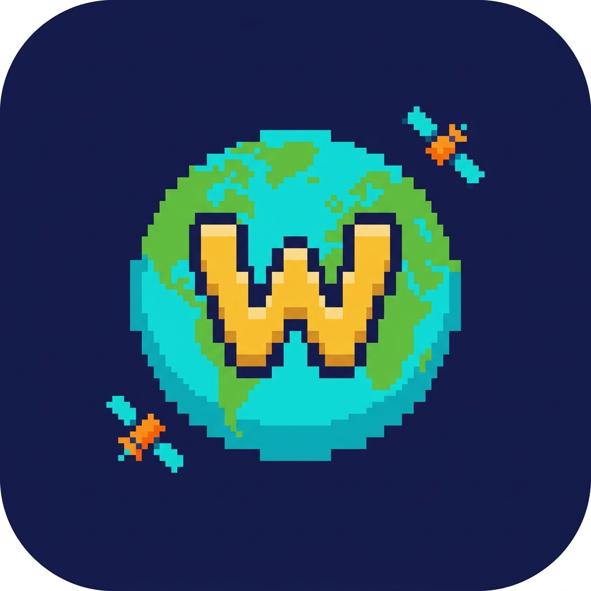

<p align="center">
  
</p>

<h1 align="center">Wookiz World 🌍</h1>

<p align="center">
  <strong>AI 1인 기업 워크스페이스 — 100% Local · 100% Offline · Free</strong><br/>
  VS Code / Cursor 확장 프로그램. 나만의 AI 에이전트 팀이 유튜브·블로그·개발·수익화 4개 사업을 함께 굴립니다.
</p>

<p align="center">
  
  
  
</p>

---

## 🌟 Overview

Wookiz World는 로컬 LLM 위에서 도는 **AI 1인 기업**입니다. CEO 에이전트가 사장님(나)의 지시를 받아 전문 에이전트들에게 작업을 분배하고, 각 에이전트는 내 지식(세컨드 브레인)·결정 로그·메모리를 컨텍스트로 일합니다. 회사 폴더와 두뇌 폴더는 GitHub에 자동 백업됩니다.

### 4대 사업 기둥

| 기둥 | 담당 에이전트 |
|:--|:--|
| 📺 유튜브·영상 콘텐츠 | 태오 (Head of YouTube) · 루시 (Sound Director) |
| ✍️ 티스토리 블로그·SEO | 한별 (SEO 작가) · 다온 (Researcher) |
| 💻 개발·제품 | 카이 (시니어 풀스택 엔지니어) |
| 💼 비즈니스·수익화 | 라온 (비즈니스 전략가) |

**지원 부서:** 🧭 CEO (총괄·작업 분배) · 📱 수민 (비서·텔레그램 브리핑) · 📷 리아 (SNS 확산) · 🎨 모네 (디자인)

---

## ⚡ Core Features

### 1. 🏢 AI 에이전트 팀
사이드바에서 `"카이야 랜딩페이지 만들어줘"`, `"한별아 이 주제로 블로그 초안 써줘"` 처럼 이름을 부르면 해당 에이전트가 바로 응답합니다. 자연어로 지시하면 CEO가 알아서 적임자에게 분배합니다.

### 2. 🧠 세컨드 브레인 (자율 지식 구조화)
던져준 원시 데이터를 에이전트가 스스로 판단해 `00_Raw`, `10_Wiki`, `🚀 Skills` 규격의 Markdown으로 정리해 저장합니다.

### 3. ☁️ 클라우드 자동 백업 (Auto-Git Sync)
파일 생성이 일어나는 순간 에이전트가 스스로 `git add · commit · push`를 수행합니다.

### 4. 🔗 로컬 모델 자동 감지
Ollama / LM Studio에 설치된 모델을 자동 감지해 드롭다운에 연결합니다.

### 5. 🤖 24시간 자율 사이클 + 데일리 브리핑
자리를 비우면 CEO가 회사 목표를 검토해 다음 한 스텝을 자동 실행하고, 매일 아침 비서 수민이 텔레그램으로 브리핑을 보냅니다.

---

## ⚒️ Agent Capabilities (에이전트 권한)

| Action | Description |
|:--|:--|
| **📄 Create Files** | 새로운 파일과 폴더를 생성합니다 |
| **✏️ Edit Files** | 기존 파일 내의 코드를 수정합니다 |
| **🗑️ Delete Files** | 불필요한 파일을 즉각 파쇄합니다 |
| **📖 Read Files** | 프로젝트 파일을 읽어 맥락을 파악합니다 |
| **📂 Browse Directories** | 디렉토리 구조를 분석합니다 |
| **🖥️ Run Commands** | `npm run build`, `git push` 등 터미널 명령을 수행합니다 |

---

## 📥 Installation (설치 방법)

### 개발자 빌드 (Build from Source)
```bash
git clone https://github.com/wookiz1102-ops/connect-ai-copy.git
cd connect-ai-copy
npm install
npm run compile
npx vsce package --no-dependencies
```
생성된 `wookiz-world-3.0.0.vsix`를 VS Code에서 `Cmd/Ctrl+Shift+P` → **Extensions: Install from VSIX**로 설치.

---

## ⚙️ Engine Setup (엔진 설정)

### ✅ LM Studio (Windows, Apple Silicon) — 권장
1. [lmstudio.ai](https://lmstudio.ai/) 에서 설치
2. Gemma 3, Llama 3 또는 Qwen Coder 등 원하는 모델 로드
3. **Developer 탭(좌측 `<>` 메뉴)** 진입 후 **Start Server** 클릭
4. Wookiz World의 ⚙️ 채팅방 설정에서 엔진을 "LM Studio"로 선택

### ✅ Ollama (Mac, Linux, Windows)
```bash
ollama pull gemma3   # 원하는 모델 풀링
```
설정에서 엔진만 "Ollama"로 바꿔주면 끝.

---

## 🔒 Privacy

- **Zero Cloud API:** 코드와 지식은 외부 클라우드로 나가지 않습니다.
- **Zero Telemetry:** 모든 연산은 100% 로컬에서 이루어집니다.

---

## 🙏 Credits

이 프로젝트는 [Connect AI](https://github.com/wonseokjung/connect-ai) (MIT License)를 기반으로 Wookiz World에 맞게 커스터마이징했습니다.

<p align="center">
  <strong>Wookiz World — my company, my agents, my world.</strong>
</p>
